# PROJECT 19

## AUTOMATE INFRASTRUCTURE WITH IAC USING TERRAFORM. PART 4 – TERRAFORM CLOUD

### What Terraform Cloud is and why use it

By now, you should be pretty comfortable writing Terraform code to provision Cloud infrastructure using **Configuration Language (HCL)** https://www.terraform.io/docs/language/. Terraform is an open-source system, that you installed and ran a Virtual Machine (VM) that you had to create, maintain and keep up to date. In Cloud world it is quite common to provide a managed version of an open-source software. Managed means that you do not have to install, configure and maintain it yourself – you just create an account and use it "as A Service".

**Terraform Cloud** https://www.terraform.io/cloud is a managed service that provides you with Terraform CLI to provision infrastructure, either on demand or in response to various events.

By default, Terraform CLI performs operation on the server where it is invoked, it is perfectly fine if you have a dedicated role who can launch it, but if you have a team who works with Terraform – you need a consistent remote environment with remote workflow and shared state to run Terraform commands.

Terraform Cloud executes Terraform commands on disposable virtual machines, this remote execution is also called **remote operations** https://www.terraform.io/docs/cloud/run/index.html.


### Migrate your .tf codes to Terraform Cloud

Le us explore how we can migrate our codes to Terraform Cloud and manage our AWS infrastructure from there:

1. Create a Terraform Cloud account
Follow this link https://app.terraform.io/signup/account, create a new account, verify your email and you are ready to start. 
Most of the features are free, but if you want to explore the difference between free and paid plans – you can check it on this page.

2. Create an organization.
Select "Start from scratch", choose a name for your organization and create it.

3. Configure a workspace
Before we begin to configure our workspace – watch this part of the video https://youtu.be/m3PlM4erixY?t=287 to better understand the difference between **version control workflow, CLI-driven workflow and API-driven workflow** and other configurations that we are going to implement.

We will use **version control workflow** as the most common and recommended way to run Terraform commands triggered from our git repository.
Create a new repository in your GitHub and call it **terraform-cloud**, push your Terraform codes developed in the previous projects to the repository.

Choose **version control workflow** and you will be promped to connect your GitHub account to your workspace – follow the prompt and add your newly created repository to the workspace.
Move on to "Configure settings", provide a description for your workspace and leave all the rest settings default, click "Create workspace".

4. Configure variables

Terraform Cloud supports two types of variables: environment variables and Terraform variables. Either type can be marked as sensitive, which prevents them from being displayed in the Terraform Cloud web UI and makes them write-only.
Set two environment variables: **AWS_ACCESS_KEY_ID and AWS_SECRET_ACCESS_KEY**, set the values that you used in Project 16. These credentials will be used to privision your AWS infrastructure by Terraform Cloud.
After you have set these 2 environment variables – yout Terraform Cloud is all set to apply the codes from GitHub and create all necessary AWS resources.

5. Now it is time to run our Terrafrom scripts, but in our previous project which was project 18, we talked about using Packer to build our images, and Ansible to configure the infrastructure, so for that we are going to make few changes to our our existing respository from Project 18.

The files that would be Added is;
 
- ami: for building packer images
- ansible: for Ansible scripts to configure the infrastucture

Before you proceed ensure you have the following tools installed on your local machine;

- packer
- Ansible

Refer to this **repository** https://github.com/darey-devops/PBL-project-19.git for guidiance on how to refactor your enviroment to meet the new changes above and ensure you go through the README.md file.

### Action Plan for project 19
1. Build images using packer

2. confirm the AMIs in the console

3. update terrafrom script with new ami IDs generated from packer build

4. create terraform cloud account and backend

5. run terraform script

6. update ansible script with values from teraform output

       - RDS endpoints for wordpress and tooling
       - Database name, password and username for wordpress and tooling
       - Access point ID for wordpress and tooling
       - Internal load balancee DNS for nginx reverse proxy

7. run ansible script

8. check the website

### Draw back in the scripts
1. Direct hardcoding of values

2. Inputting credentials directly in the script

Useful links for windows users https://docs.microsoft.com/en-us/windows-server/administration/openssh/openssh_keymanagement https://docs.microsoft.com/en-us/windows-server/administration/openssh/openssh_install_firstuse https://medium.com/risan/upgrade-your-ssh-key-to-ed25519-c6e8d60d3c54

### Build the following AMIs with Packer
        - bastion ami
        - nginx ami
        - ubuntu ami
        - web ami for wordpress and tooling sites

Navigate to the folder where you have your ami pac ker hcl and shell scripts.

Run `packer build <pkr.hcl file>`

Please refer to the below repository for the codes and the shell scripts for building the above AMIs and the for the ansible - https://github.com/onyeka-hub/terraform-cloud.git

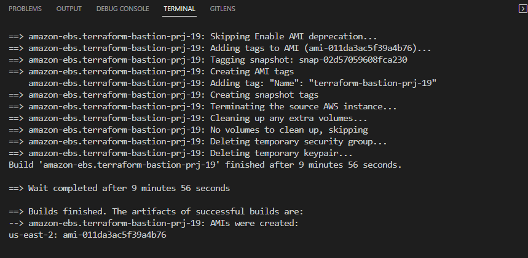

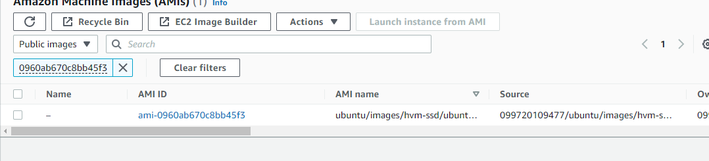

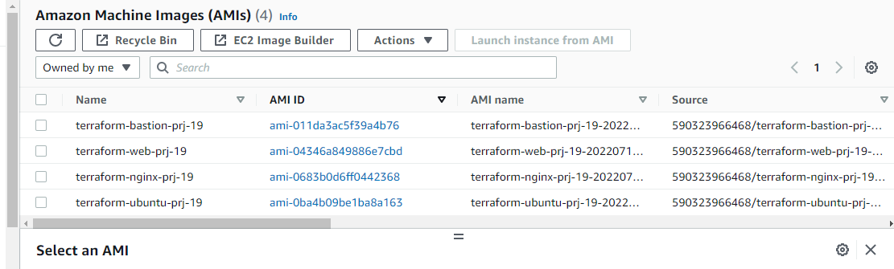

- Now copy all the AMI IDs and update the terraform.auto.tfvars file

6. Run terraform plan and terraform apply from web console

Switch to "Runs" tab and click on "Queue plan manualy" button. If planning has been successfull, you can proceed and confirm Apply – press "Confirm and apply", provide a comment and "Confirm plan"

Check the logs and verify that everything has run correctly. Note that Terraform Cloud has generated a unique state version that you can open and see the codes applied and the changes made since the last run.

7. Test automated **terraform plan**

By now, you have tried to launch plan and apply manually from Terraform Cloud web console. But since we have an integration with GitHub, the process can be triggered automatically. Try to change something in any of .tf files and look at "Runs" tab again – plan must be launched automatically, but to apply you still need to approve manually. Since provisioning of new Cloud resources might incur significant costs. Even though you can configure "Auto apply", it is always a good idea to verify your plan results before pushing it to apply to avoid any misconfigurations that can cause ‘bill shock’.

**Note**: First, try to approach this project on your own, but if you hit any blocker and could not move forward with the project, refer to this video https://youtu.be/nCemvjcKuIA

**Note**: 
        - Because we have not configured our servers (nginx proxy, wordpress and tooling) it will be failing health checks, therefore we need to deregister them from the target group so that we can easily configure them without the autoscaling group spinning up new instances.
        - We also need to de-attach the target groups (nginx proxy, wordpress and tooling) group from the laodbalancers so that the loadbalancers would not forward traffic to the instances during our configuration.

**Note**:
- That the ansible files should be in another directory in github because the bastion server needs to clone this repository to be able to run the playbook.
- That the ansible needs to connect to our aws account to pull down the private ip address of our servers , therefore we need to run `aws configure` on our bastion so that it can have the credentials to connect to the servers.
- Using ssh-agent, through vscode, connect to the bastion host and clone the https://github.com/onyeka-hub/ansible-deploy-pro-19.git repository.

8. Update ansible script with values from teraform output

        - RDS endpoints for wordpress and tooling
        - Database name, password and username for wordpress and tooling
        - Access point ID for wordpress and tooling
        - Internal load balancer DNS for nginx reverse proxy

9. Run ansible script.

Check the dynamic inventory by running this command:

```
ansible-inventory --graph -i inventory/aws_ec2.yml
```
### Blocker

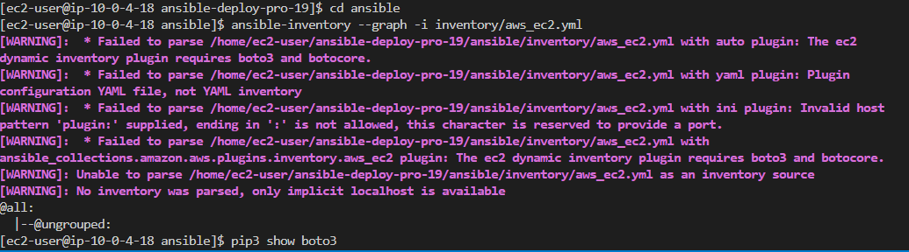

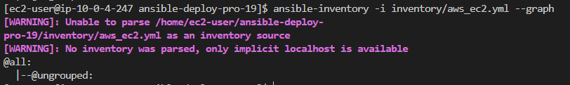

To solve this problem i had to intall boto3 and botocore with python3.8

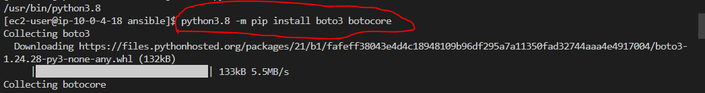

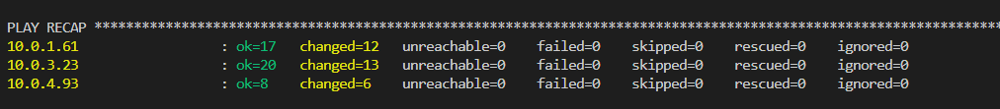

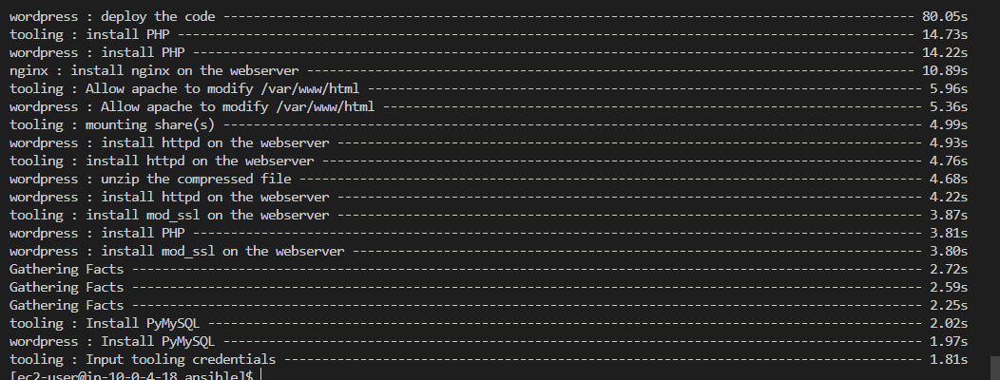


10. check the website


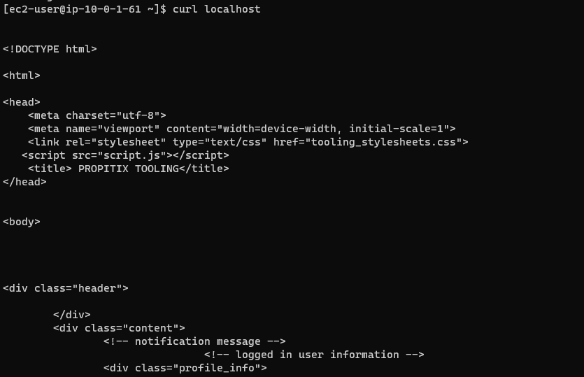

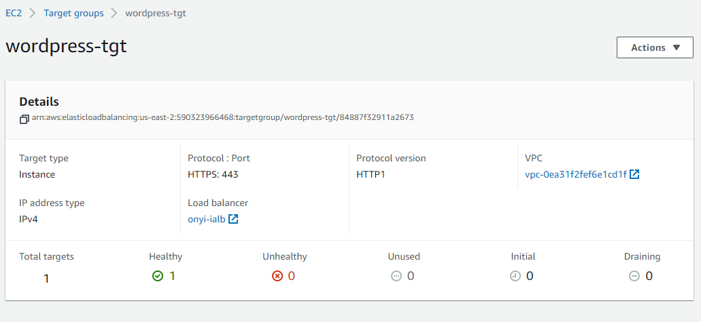

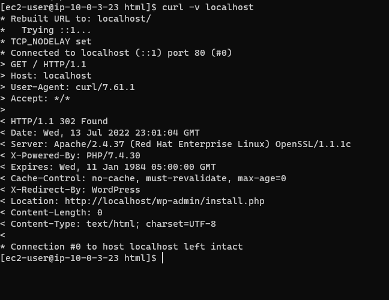

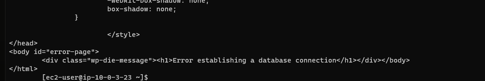


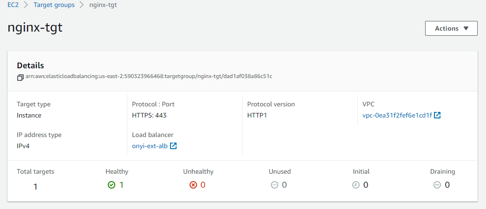

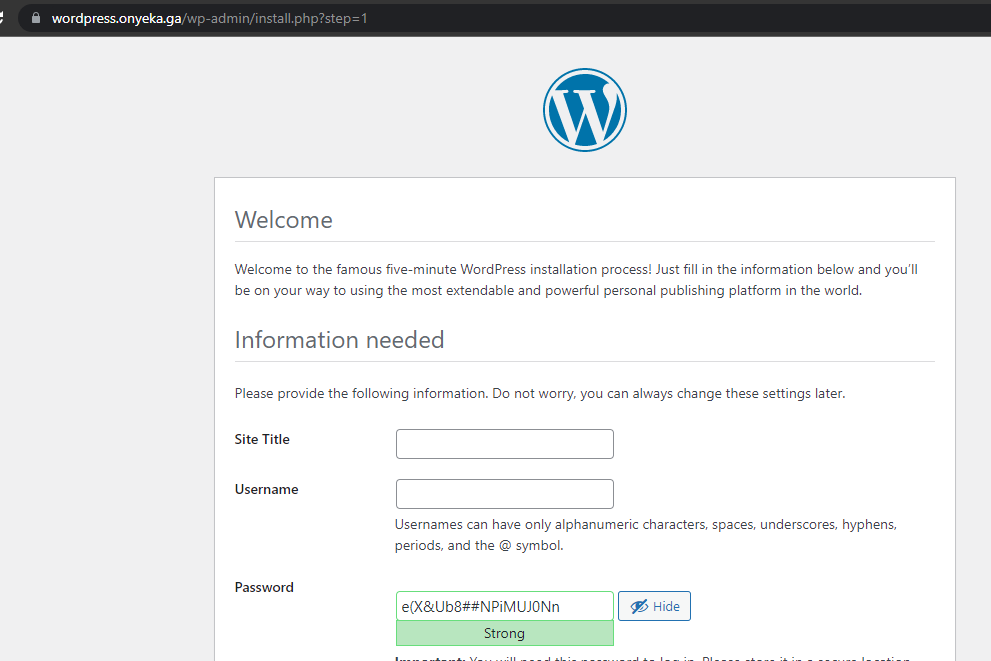

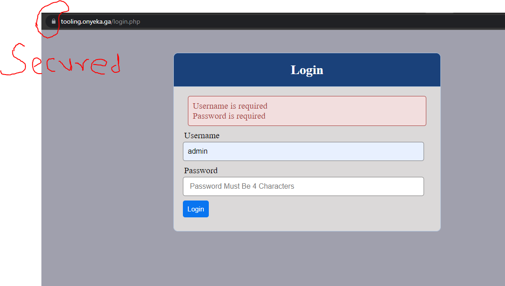


### Practice Task №1

1. Configure 3 branches in your terraform-cloud repository for dev, test, prod environments
2. Make necessary configuration to trigger runs automatically only for dev environment
3. Create an Email and Slack notifications for certain events (e.g. started plan or errored run) and test it
4. Apply destroy from Terraform Cloud web console

### Public Module Registry vs Private Module Registry

Terraform has a quite strong community of contributors (individual developers and 3rd party companies) that along with HashiCorp maintain a Public Registry, where you can find reusable configuration packages (modules). We strongly encourage you to explore modules shared to the public registry, specifically for this project – you can check out this AWS provider registy page.

As your Terraform code base grows, your DevOps team might want to create you own library of reusable components – Private Registry can help with that.

### Practice Task №2 Working with Private repository

1. Create a simple Terraform repository (you can clone one from here) that will be your module
2. Import the module into your private registry
3. Create a configuration that uses the module
4. Create a workspace for the configuration
5. Deploy the infrastructure
6. Destroy your deployment

**Note**: First, try to approach this task oun your own, but if you have any difficulties with it, refer to this tutorial https://learn.hashicorp.com/tutorials/terraform/module-private-registry.

Congratulations!


You have learned how to effectively use managed version of Terraform – Terraform Cloud. You have also practiced in finding modules in a Public Module Registry as well as build and deploy your own modules to a Private Module Registry.
