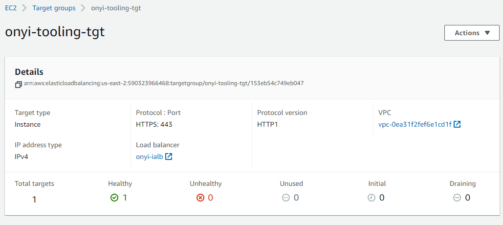

# PROJECT 19

## AUTOMATE INFRASTRUCTURE WITH IAC USING TERRAFORM. PART 4 – TERRAFORM CLOUD

### What Terraform Cloud is and why use it

By now, you should be pretty comfortable writing Terraform code to provision Cloud infrastructure using **Configuration Language (HCL)** https://www.terraform.io/docs/language/. Terraform is an open-source system, that you installed and ran a Virtual Machine (VM) that you had to create, maintain and keep up to date. In Cloud world it is quite common to provide a managed version of an open-source software. Managed means that you do not have to install, configure and maintain it yourself – you just create an account and use it "as A Service".

**Terraform Cloud** https://www.terraform.io/cloud is a managed service that provides you with Terraform CLI to provision infrastructure, either on demand or in response to various events.

By default, Terraform CLI performs operation on the server where it is invoked, it is perfectly fine if you have a dedicated role who can launch it, but if you have a team who works with Terraform – you need a consistent remote environment with remote workflow and shared state to run Terraform commands.

Terraform Cloud executes Terraform commands on disposable virtual machines, this remote execution is also called **remote operations** https://www.terraform.io/docs/cloud/run/index.html.


### Migrate your .tf codes to Terraform Cloud

Let us explore how we can migrate our codes to Terraform Cloud and manage our AWS infrastructure from there:

1. Create a Terraform Cloud account
Follow this link https://app.terraform.io/signup/account, create a new account, verify your email and you are ready to start. 

Most of the features are free, but if you want to explore the difference between free and paid plans – you can check it on this page.

2. Create an organization.
Select "Start from scratch", choose a name for your organization and create it.

3. Configure a workspace

Before we begin to configure our workspace – watch this part of the video https://youtu.be/m3PlM4erixY?t=287 to better understand the difference between **version control workflow, CLI-driven workflow and API-driven workflow** and other configurations that we are going to implement.

We will use **version control workflow** as the most common and recommended way to run Terraform commands triggered from our git repository.

Create a new repository in your GitHub and call it **terraform-cloud**, push your Terraform codes developed in the previous projects to the repository. https://github.com/onyeka-hub/terraform-cloud.git

Choose **version control workflow** and you will be promped to connect your GitHub account to your workspace – follow the prompt and add your newly created repository to the workspace.
Move on to "Configure settings", provide a description for your workspace and leave all the rest settings default, click "Create workspace".

4. Configure variables

Terraform Cloud supports two types of variables: environment variables and Terraform variables. Either type can be marked as sensitive, which prevents them from being displayed in the Terraform Cloud web UI and makes them write-only.

Set two environment variables: **AWS_ACCESS_KEY_ID and AWS_SECRET_ACCESS_KEY**, set the values that you used in Project 16. These credentials will be used to provision your AWS infrastructure by Terraform Cloud.

After you have set these 2 environment variables – your Terraform Cloud is all set to apply the codes from GitHub and create all necessary AWS resources. Remember to select your working directory if your terraform code is not at the root directory of your github repo.

5. Now it is time to run our Terrafrom scripts, but in our previous project which was project 18, we talked about using Packer to build our images, and Ansible to configure the infrastructure, so for that we are going to make few changes to our our existing respository from Project 18.

The files that would be Added is;
 
- ami: for building packer images
- ansible: for Ansible scripts to configure the infrastucture

Before you proceed ensure you have the following tools installed on your local machine;

- packer
- Ansible

Refer to this **repository** https://github.com/darey-devops/PBL-project-19.git for guidiance on how to refactor your enviroment to meet the new changes above and ensure you go through the README.md file.

### Action Plan for project 19

1. Build the following AMIs with Packer
        - bastion ami
        - nginx ami
        - ubuntu ami for jenkins, sonarqube and artifactory
        - web ami for wordpress and tooling sites

Navigate to the folder where you have your ami packer hcl and shell scripts and run
```
packer init
packer fmt
packer build <pkr.hcl file>
```

Please refer to the below repository for the codes and the shell scripts for building the above AMIs and the for the ansible - https://github.com/onyeka-hub/terraform-cloud.git


- Now copy all the AMI IDs and update the terraform.auto.tfvars file.

2. Confirm the AMIs in the console

3. Update terrafrom script with new ami IDs generated from packer build. Now copy all the AMI IDs and update the terraform.auto.tfvars file

4. Create terraform cloud account and backend

5. Run terraform plan and terraform apply from web console

Switch to "Runs" tab and click on "Queue plan manualy" button. If planning has been successfull, you can proceed and confirm Apply – press "Confirm and apply", provide a comment and "Confirm plan"

Check the logs and verify that everything has run correctly. Note that Terraform Cloud has generated a unique state version that you can open and see the codes applied and the changes made since the last run.

6. Test automated **terraform plan**

By now, you have tried to launch plan and apply manually from Terraform Cloud web console. But since we have an integration with GitHub, the process can be triggered automatically. Try to change something in any of .tf files and look at "Runs" tab again – plan must be launched automatically, but to apply you still need to approve manually. Since provisioning of new Cloud resources might incur significant costs. Even though you can configure "Auto apply", it is always a good idea to verify your plan results before pushing it to apply to avoid any misconfigurations that can cause ‘bill shock’.

First, try to approach this project on your own, but if you hit any blocker and could not move forward with the project, refer to this video https://youtu.be/nCemvjcKuIA

## Note

- Because we have not configured our servers (nginx proxy, wordpress and tooling) it will be failing health checks, therefore we need to deregister them from the target group so that we can easily configure them without the autoscaling group spinning up new instances.

- We also need to de-attach the target groups (nginx proxy, wordpress and tooling) group from the laodbalancers so that the loadbalancers would not forward traffic to the instances during our configuration.

- Or At this time the instances may fail health check because we have not configure apache and nginx and have not set the health check path which is /healthstatus. So we need to remove the instances from the target group before configuring them. We can remove them from the console by deregistering them or remove these instances from the listener of the load balancers by commenting out the resource "aws_lb_listener" "nginx-listner", resource "aws_lb_listener" "web-listener" and resource "aws_lb_listener_rule" "tooling-listener" portions in the modules/alb/main.tf.

- Secondary we know that the autoscaling group is attached to a load balancer, for us to make sure that the auto scaling group do not spin up any instance for the load balancer, we will comment out auto scaling attachment resource "aws_autoscaling_attachment" "asg_attachment_nginx" at modules/Autoscaling/asg-bastion-nginx.tf and both resource "aws_autoscaling_attachment" "asg_attachment_wordpress" and resource "aws_autoscaling_attachment" "asg_attachment_tooling"  at modules/Autoscaling/asg-wordpress-tooling.tf. This will make the auto scaling group not to spin up instances and the target group will not have any instances.

- Add, commit and push your changes. Check the target group and notice that the instances have been deregistered and also that the listener on the load balancer have been removed.

7. The ansible files should be in another directory in github because the bastion server needs to clone this repository to be able to run the playbook.

8. Update ansible script with values from teraform output from the below resources

- /terraform-cloud/ansible/roles/nginx/templates/nginx.conf.j2 - Internal load balancer DNS for nginx reverse proxy

- /terraform-cloud/ansible/roles/tooling/tasks/main.yml - Access point ID for tooling

- /terraform-cloud/ansible/roles/tooling/tasks/setup-db.yml - RDS endpoints, master-name and master-password

- /terraform-cloud/ansible/roles/wordpress/tasks/main.yml - Access point ID for wordpress

- /terraform-cloud/ansible/roles/wordpress/tasks/setup-db.yml - RDS endpoints, master-name and master-password
 

9. Run ansible script. Before running the ansible script:

- Configure your bastion server with your aws access keys and secret access keys.The ansible needs to connect to our aws account to pull down the private ip address of our servers, therefore we need to run `aws configure` on our bastion so that it can have the credentials to connect to the servers.

- Using ssh-agent, through vscode, connect to the bastion host and clone the https://github.com/onyeka-hub/ansible-deploy-pro-19.git repository.

- Confirm that your bastion can pull down data or talk to your aws resources. 

```
aws ec2 describe-instances
```

- Check whether the aws_ec2 dynamic inventory plugin is working. The aws_ec2 dynamic inventory plugin makes API calls to AWS to get a list of inventory hosts from Amazon Web Services EC2 in the run time. It gives the EC2 instance details dynamically to manage the AWS infrastructure. It should give you the list of your instances with their private ip, tag name, etc.

```
ansible-inventory -i inventory/aws_ec2.yml --graph
```

## Blocker
```
[WARNING]:  * Failed to parse /home/ec2-user/terraform-cloud/ansible/inventory/aws_ec2.yml with auto plugin: Failed to import the required Python library (botocore and boto3) on ip-10-0-4-42.us-east-2.compute.internal's Python /usr/bin/python3.11. Please read the module documentation and install it in the appropriate location. If the required library is installed, but Ansible is using the wrong Python interpreter, please consult the documentation on ansible_python_interpreter
[WARNING]:  * Failed to parse /home/ec2-user/terraform-cloud/ansible/inventory/aws_ec2.yml with yaml plugin: Plugin configuration YAML file, not YAML inventory
[WARNING]:  * Failed to parse /home/ec2-user/terraform-cloud/ansible/inventory/aws_ec2.yml with ini plugin: Invalid host pattern 'plugin:' supplied, ending in ':' is not allowed, this character is reserved to provide a port.
[WARNING]: Unable to parse /home/ec2-user/terraform-cloud/ansible/inventory/aws_ec2.yml as an inventory source
[WARNING]: No inventory was parsed, only implicit localhost is available
```

## Trouble shooting

I have to try installing botocore and boto3 with `pip install botocore boto3` and encountered this error:
```
Defaulting to user installation because normal site-packages is not writeable
Requirement already satisfied: botocore in /usr/local/lib/python3.6/site-packages (1.26.10)
Requirement already satisfied: boto3 in /usr/local/lib/python3.6/site-packages (1.23.10)
Requirement already satisfied: jmespath<2.0.0,>=0.7.1 in /usr/local/lib/python3.6/site-packages (from botocore) (0.10.0)
Requirement already satisfied: urllib3<1.27,>=1.25.4 in /usr/local/lib/python3.6/site-packages (from botocore) (1.26.17)
Requirement already satisfied: python-dateutil<3.0.0,>=2.1 in /usr/lib/python3.6/site-packages (from botocore) (2.6.1)
Requirement already satisfied: s3transfer<0.6.0,>=0.5.0 in /usr/local/lib/python3.6/site-packages (from boto3) (0.5.2)
Requirement already satisfied: six>=1.5 in /usr/lib/python3.6/site-packages (from python-dateutil<3.0.0,>=2.1->botocore) (1.11.0)
```

## Solution 

Looking at the bastion.sh script used for creating the bastion aim, there is a command for installing both python3 and ansible using yum. It will install python3 and while installing ansible will also install python3.11.

The error message I received when I tried installing boto3 indicates that I am trying to install Python packages using pip, but it defaults to user installation because the system-wide site-packages directory is not writeable.

In my case, it appears that I have Python packages already installed system-wide at these locations (e.g., in /usr/local/lib/python3.6/site-packages and /usr/lib/python3.6/site-packages).

On running 
```
ansible --version | grep "python version"
python version = 3.11.2 (main, Jun 9 2022, 00:00:00) [GCC 12.1.1 20220507 (Red Hat 12.1.1-1)] (/usr/bin/python)
```
the version of python used the ansible is different from the python3.6 and that was the cause of the conflict, the required library is installed, but Ansible is using the wrong Python interpreter.

To solve the problem, I had to deregister the bastion aim, removed the yum install ansible command from the bastion.sh script and replaced with `pip3 install ansible` because the easiest way to run /usr/bin/ansible under Python 3 is to install it with the Python3 version of pip. This will make the default /usr/bin/ansible run with Python3. Though could not bake with the aim, but i had to manually install it while looking for other ways to acheive this.

```
pip3 list | grep boto
ls /usr/bin/ | grep python
whereis python
which python3
which python3.6
whereis pip
pip3 install ansible
whereis ansible
which ansible
ls /usr/lib/
ls /usr/local/lib/
ls /usr/local/lib/python3.6/site-packages/
ansible --version | grep "python version"
```

After installing ansible, the dynamic inventory plugin was able to pull my aws ec2 details.

10. Run ansible script.

### Blocker


To solve this problem i had to intall boto3 and botocore with python3.8


11. check the website and trouble shoot if need be. Confirm that the databses wordpressdb and toolingdb were created. That the master-username and master-password were properly injected into wp-sample.php and function.php file. And that the reverse proxy is properly configured. Confirm that you have your certificates and keys at the location.




## Trouble shooting commands
```
curl -L localhost

aws iam delete-instance-profile --instance-profile-name aws_instance_profile_test

aws ec2 describe-instances

ansible --version | grep "python version"

ansible-inventory -i inventory/aws_ec2.yml --graph

/usr/local/lib/python

/usr/lib/python


pip3 list | grep boto
ansible --version | grep "python version"
whereis python
which python
which python3
which python3.6
which python3.11
whereis ansible
whereis pip
pip3 install ansible
whereis ansible
which ansible
ls /usr/bin/ | grep python
ls /usr/local/lib/
ls /usr/local/lib/python3.6/site-packages/
ansible --version | grep "python version"
git clone https://github.com/onyeka-hub/terraform-cloud.git
ansible-inventory -i inventory/aws_ec2.yml --graph
whereis mysql
whereis git
whereis tmux
which tmux
history
```


### Practice Task №1

1. Configure 3 branches in your terraform-cloud repository for dev, test, prod environments
2. Make necessary configuration to trigger runs automatically only for dev environment
3. Create an Email and Slack notifications for certain events (e.g. started plan or errored run) and test it
4. Apply destroy from Terraform Cloud web console

### Public Module Registry vs Private Module Registry

Terraform has a quite strong community of contributors (individual developers and 3rd party companies) that along with HashiCorp maintain a Public Registry, where you can find reusable configuration packages (modules). We strongly encourage you to explore modules shared to the public registry, specifically for this project – you can check out this AWS provider registy page.

As your Terraform code base grows, your DevOps team might want to create you own library of reusable components – Private Registry can help with that.

### Practice Task №2 Working with Private repository

1. Create a simple Terraform repository (you can clone one from here) that will be your module
2. Import the module into your private registry
3. Create a configuration that uses the module
4. Create a workspace for the configuration
5. Deploy the infrastructure
6. Destroy your deployment

**Note**: First, try to approach this task oun your own, but if you have any difficulties with it, refer to this tutorial https://learn.hashicorp.com/tutorials/terraform/module-private-registry.

Congratulations!


You have learned how to effectively use managed version of Terraform – Terraform Cloud. You have also practiced in finding modules in a Public Module Registry as well as build and deploy your own modules to a Private Module Registry.

### Draw back in the scripts
- Direct hardcoding of values

- Inputting credentials directly in the script

Useful links for windows users https://docs.microsoft.com/en-us/windows-server/administration/openssh/openssh_keymanagement https://docs.microsoft.com/en-us/windows-server/administration/openssh/openssh_install_firstuse https://medium.com/risan/upgrade-your-ssh-key-to-ed25519-c6e8d60d3c54

